# Miftah Program Board — 2026-07-13

North-star: make Quran understanding measurable and central through **Understanding Coverage %** and a guided **Understanding Path**.

Verified base: local `main` at `f50d83d`, clean before Wave 7 dispatch, 77 commits ahead of `origin/main`. Nothing in this board authorizes a push, production deploy, or migration.

## Wave map

```mermaid
flowchart LR
    P0[Phase 0<br/>Consolidation<br/>DONE]
    W0[W0 Scaffold<br/>DONE]
    W1[W1 Mushaf fence<br/>DONE]
    W2[W2 Tema<br/>DONE]
    W3[W3 Tasmi boundary<br/>DONE]
    W4[W4 Home<br/>DONE]
    W5[W5 Faham<br/>DONE]
    W55[W5.5 Understanding + perf<br/>DONE LOCALLY]
    W6[W6 Hifz<br/>DONE LOCALLY]
    W7[W7 Read integration hub<br/>ACTIVE]
    W8[W8 Shared/PWA + repo finalization<br/>QUEUED]
    P2[Phase 2<br/>Coverage-led product redesign<br/>BLOCKED BY W7-W8 + DATA SIGN-OFF]
    P3[Phase 3<br/>QA + relaunch<br/>QUEUED]

    P0 --> W0 --> W1 --> W2 --> W3 --> W4 --> W5 --> W55 --> W6 --> W7 --> W8 --> P2 --> P3
```

## Active lanes

| Lane | Worktree / branch | Ownership | Status | Exit gate |
|---|---|---|---|---|
| W7-A Read shell/domain | `miftah-worktrees/wave7-read-shell` / `phase-1/wave7-read-shell` | `features/read`, Read components, pure Read domain, thin `app/read` shells | RUNNING | public boundary; large Read files decomposed; route behavior preserved; tests/lint/build |
| W7-B Read data/perf | `miftah-worktrees/wave7-read-data` / `phase-1/wave7-read-data` | typed Read repositories, `api/read`, Supabase-bearing Read libs | RUNNING | no unsafe auth change; known IDs reused; explicit select columns; focused tests/lint/build |
| W7-V Independent verification | read-only on `main` | route/overlay matrix, boundaries, test and visual contract | RUNNING | acceptance checklist plus critical findings |
| W7-I Tower integration | `main` | review commits, resolve only integration seams, merge with `--no-ff` | WAITING | combined tests, lint, production build, route/overlay smoke, visual evidence |

## Completion queue and gains

| Order | Wave/lane | What completion gains | What it unblocks |
|---:|---|---|---|
| 1 | Wave 7 | Removes the last high-coupling integration hub; isolates Read UI, audio, navigation, and data access; cuts known Read over-fetch | Safe repository finalization and stable product surfaces for the redesign |
| 2 | Wave 8 | Finishes PWA/shared boundaries and drives direct Supabase imports outside `data/` to zero | Phase 1 architecture closure and a clean Auth/RLS seam |
| 3 | Coverage data-quality gate | Resolves the 96,219-vs-77,429 denominator and mastery semantics | Honest public Understanding Coverage claim |
| 4 | Phase 2 UX + onboarding | Wires coverage hero, Understanding Path, next-best-word curriculum, grammar keys | A product users can understand, pursue, and measure |
| 5 | Auth + license + Tasmi production lanes | Activates multi-user identity, payment entitlement, and phrase-level recitation | Commercial relaunch candidate |
| 6 | Phase 3 QA/relaunch | Full regression, accessibility, device, migration rehearsal, cohort win-back | Operator-reviewed production launch |

## Non-negotiable gates

- Do not push `main`, deploy, or apply production migrations without an explicit operator **go**.
- The pending Tema migration contains a destructive `TRUNCATE` and production serves about 71 real users.
- Do not publish Understanding Coverage until frequency and mastery data receive operator sign-off.
- A worker's green result is provisional: integration reruns the real combined gates on `main`.
