# Miftah Program Board — 2026-07-13

North-star: make Quran understanding measurable and central through **Understanding Coverage %** and a guided **Understanding Path**.

Verified base: local `main` at `cdfd7c8d`, clean during Wave 8 closure, 95 commits ahead of `origin/main`. Nothing in this board authorizes a push, production deploy, or migration.

## Wave map

```mermaid
flowchart LR
    P0[Phase 0<br/>Consolidation<br/>DONE]
    W0[W0 Scaffold<br/>DONE]
    W1[W1 Mushaf fence<br/>DONE]
    W2[W2 Tema<br/>DONE]
    W3[W3 Tasmi boundary<br/>DONE]
    W4[W4 Home<br/>DONE]
    W5[W5 Faham<br/>DONE]
    W55[W5.5 Understanding + perf<br/>DONE LOCALLY]
    W6[W6 Hifz<br/>DONE LOCALLY]
    W7[W7 Read integration hub<br/>DONE LOCALLY]
    W8[W8 Shared/PWA + repo finalization<br/>CLOSING]
    P2[Phase 2<br/>Coverage-led product redesign<br/>BLOCKED BY W8 + DATA SIGN-OFF]
    P3[Phase 3<br/>QA + relaunch<br/>QUEUED]

    P0 --> W0 --> W1 --> W2 --> W3 --> W4 --> W5 --> W55 --> W6 --> W7 --> W8 --> P2 --> P3
```

## Active lanes

| Lane | Worktree / branch | Ownership | Status | Exit gate |
|---|---|---|---|---|
| W8-A Shared/data + Auth | merged on `main` at `f9339a26` | Supabase boundary, activity/auth/shared destinations, bot import swaps | DONE LOCALLY | 206 node-compatible suites; bot smokes; lint/build; zero web Supabase calls outside `data/` |
| W8-B PWA boundary | merged on `main` at `37a2858b` | `shared/pwa`, PWA components, download-engine decomposition | DONE LOCALLY | 55/55 PWA tests; files under 400 LOC; no Shared→Feature cycle; lint/build |
| W8-C Read/Auth payload guard | merged on `main` at `bcfa2be5` | defer Auth runtime; enforce Read payload/forbidden-runtime budget | DONE LOCALLY | independent negative-control review; 130,242 raw / 35,732 gzip on combined fresh build |
| W8-D Tema repository split | merged on `main` at `cdfd7c8d` | split 788-line repository behind stable public facade | DONE LOCALLY | 6/6 Tema tests; focused lint; 34-route build; stable exports |
| W8-E Mushaf asset split | `wave8-mushaf-assets` / `phase-1/wave8-mushaf-assets` | split asset resolution behind stable facade | FIX REQUIRED | independent review found two prebuild scripts reading the moved CDN version; official build must pass |
| W8-F Tasmi + TypeScript | `wave8-tasmi-types` / `phase-1/wave8-tasmi-types` | split final Tasmi UI; clear full `tsc`; durable Vitest aliases | RUNNING | full `tsc`; 75 relevant tests; lint; official build |
| W8-I Tower integration | `main` | independently review/merge remaining commits and run combined gates | RUNNING | full tests/typecheck/lint/build/perf/bot smoke; no stale boundaries |

## Completion queue and gains

| Order | Wave/lane | What completion gains | What it unblocks |
|---:|---|---|---|
| 1 | Wave 7 | Removes the last high-coupling integration hub; isolates Read UI, audio, navigation, and data access; cuts known Read over-fetch | Safe repository finalization and stable product surfaces for the redesign |
| 2 | Wave 8 | Finishes PWA/shared boundaries and drives direct Supabase imports outside `data/` to zero | Phase 1 architecture closure and a clean Auth/RLS seam |
| 3 | Coverage data-quality gate | Resolves the 96,219-vs-77,429 denominator and mastery semantics | Honest public Understanding Coverage claim |
| 4 | Phase 2 UX + onboarding | Wires coverage hero, Understanding Path, next-best-word curriculum, grammar keys | A product users can understand, pursue, and measure |
| 5 | Auth + license + Tasmi production lanes | Activates multi-user identity, payment entitlement, and phrase-level recitation | Commercial relaunch candidate |
| 6 | Phase 3 QA/relaunch | Full regression, accessibility, device, migration rehearsal, cohort win-back | Operator-reviewed production launch |

## Latest closed-wave evidence

- Wave 7 merged locally at `275e6bc2`.
- 79/79 combined Read, Read-data, and PWA tests pass; focused lint and the webpack production build pass across 34 routes.
- `ReadPageWorkspace`: 1,165 → 240 LOC; `ReadAudioDock`: 950 → 379; `PageAudioControls`: 456 → 330.
- Read required client chunks: 632,055 → 133,651 raw bytes and 170,478 → 37,312 gzip; ONNX, MicVAD, VAD-web, and TasmiRecorder remain deferred.
- Wave 8 shared/data and PWA boundaries are merged locally; all web Supabase factories/calls now live under `src/data/**`, and `shared/**` is lint-fenced from importing features.
- Integration caught and fixed an Auth barrel leak before release: the fresh combined Read entry is 130,242 raw / 35,732 gzip, with Auth and voice runtimes excluded and enforced by a budget gate.
- Tema's 788-line repository is now a 12-line stable facade over cohesive modules below 250 lines; all six Tema regression tests pass.
- Independent review blocked the first Mushaf asset split because two prebuild scripts still read the old source file. The lane remains unmerged until the official build path is repaired and re-verified.
- External gate still open: authenticated overlay/manual visual comparison on a normal host.

## Non-negotiable gates

- Do not push `main`, deploy, or apply production migrations without an explicit operator **go**.
- The pending Tema migration contains a destructive `TRUNCATE` and production serves about 71 real users.
- Do not publish Understanding Coverage until frequency and mastery data receive operator sign-off.
- A worker's green result is provisional: integration reruns the real combined gates on `main`.
